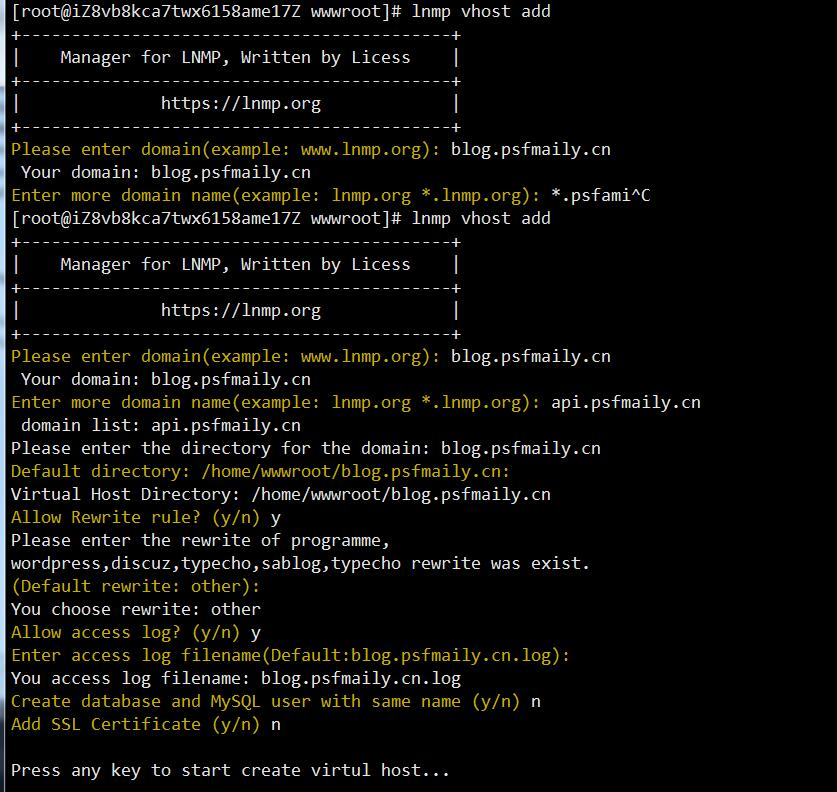
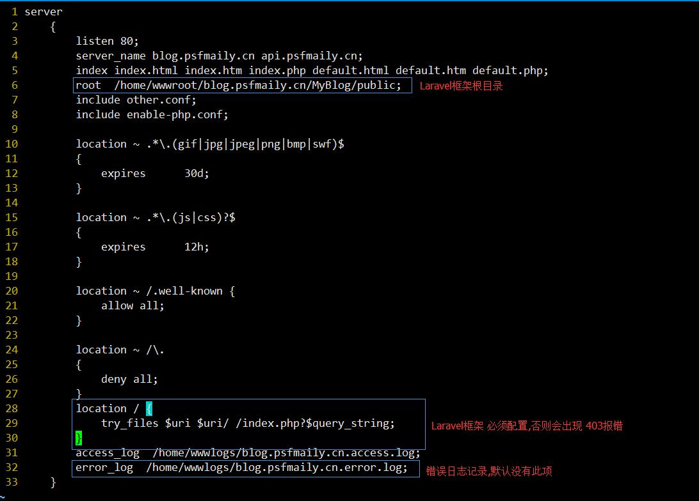

# 项目部署

## 服务器环境安装

    参考 lnmp 一键安装包的教程即可

    LNMP相关配置文件位置

    Nginx主配置(默认虚拟主机)文件：/usr/local/nginx/conf/nginx.conf
    添加的虚拟主机配置文件：/usr/local/nginx/conf/vhost/域名.conf
    MySQL配置文件：/etc/my.cnf
    PHP配置文件：/usr/local/php/etc/php.ini
    php-fpm配置文件：/usr/local/php/etc/php-fpm.conf
    PureFtpd配置文件：/usr/local/pureftpd/pure-ftpd.conf 1.3及更高版本：/usr/local/pureftpd/etc/pure-ftpd.conf
    PureFtpd MySQL配置文件：/usr/local/pureftpd/pureftpd-mysql.conf
    Proftpd配置文件：/usr/local/proftpd/etc/proftpd.conf 1.2及之前版本为/usr/local/proftpd/proftpd.conf
    Proftpd 用户配置文件：/usr/local/proftpd/etc/vhost/用户名.conf
    Redis 配置文件：/usr/local/redis/etc/redis.conf

    lnmp 基本命令
    Usage: lnmp {start|stop|reload|restart|kill|status}
    Usage: lnmp {nginx|mysql|mariadb|php-fpm|pureftpd} {start|stop|reload|restart|kill|status}
    Usage: lnmp vhost {add|list|del}
    Usage: lnmp database {add|list|edit|del}
    Usage: lnmp ftp {add|list|edit|del|show}
    Usage: lnmp ssl add

## 第一步:创建虚拟主机

使用 `lnmp vhost add` 根据提示,填写相关配置信息

配置完毕后,会在 `/home/wwwroot/` 目录下创建一个目录: `blog.psfmaily.cn`

该目录下会自动创建一个 `.user.ini` 文件,用户指定 PHP能够访问的目录,该文件处于锁定状态,不能更改|删除

    [root@iZ8vb8kca7twx6158ame17Z blog.psfmaily.cn]# ll -a
    total 12
    drwxr-xr-x 2 www  www  4096 Aug 25 15:47 .
    drwxr-xr-x 4 root root 4096 Aug 25 15:47 ..
    -rw-r--r-- 1 root root   57 Aug 25 15:47 .user.ini

.user.ini  无法删除

因为他的权限在锁定状态,需要使用 `chattr` 命令解除锁定

`chattr -i .user.ini` 解除锁定
`chattr +i .user.ini` 加上锁定

## 第二步:从 git 克隆项目
1.进入项目目录 `cd blog.psfmaily.cn`

2.执行命令 `git clone https://git.oschina.net/peijiyang/MyBlog.git`

克隆授权

    [root@iZ8vb8kca7twx6158ame17Z blog.psfmaily.cn]# git clone https://git.oschina.net/peijiyang/MyBlog.git
    Cloning into 'MyBlog'...
    Username for 'https://git.oschina.net': peijiyang
    Password for 'https://peijiyang@git.oschina.net':

克隆完成

    [root@iZ8vb8kca7twx6158ame17Z blog.psfmaily.cn]# ll -a
    total 16
    drwxr-xr-x  3 www  www  4096 Aug 25 16:06 .
    drwxr-xr-x  4 root root 4096 Aug 25 15:47 ..
    drwxr-xr-x 13 root root 4096 Aug 25 16:06 MyBlog
    -rw-r--r--  1 root root   57 Aug 25 15:47 .user.ini

### 第三步:更改项目的属主属组及权限
> 使用命令 `cp .env.example .env` 创建一份 配置文件

> 使用命令 `chmod -R 755 MyBlog` , -R 递归修改 ;是 `storage` 和 `bootstrap` 文件夹及子目录具有写权限,因为 框架运行产生的一些临时文件,日志文件都在此

> 使用命令 `chown -R www:www MyBlog` 更改属组, www 用户为 Nginx 的用户

### 第四步:相关配置修改

##### (1) .env 项目配置更改

> `vim .env` 修改数据库配置及Redis 配置

##### (2) 虚拟主机配置修改

目录 `/usr/local/nginx/conf/vhost`

执行命令 `vim /usr/local/nginx/conf/vhost/blog.psfmaily.cn.conf`

进行如下编辑

### 第五步:重启服务器

命令 `lnmp restart`

### 第六步:查看是否配置成功

若出现 500 错误,则查看 error.md 进行 粗暴处理

